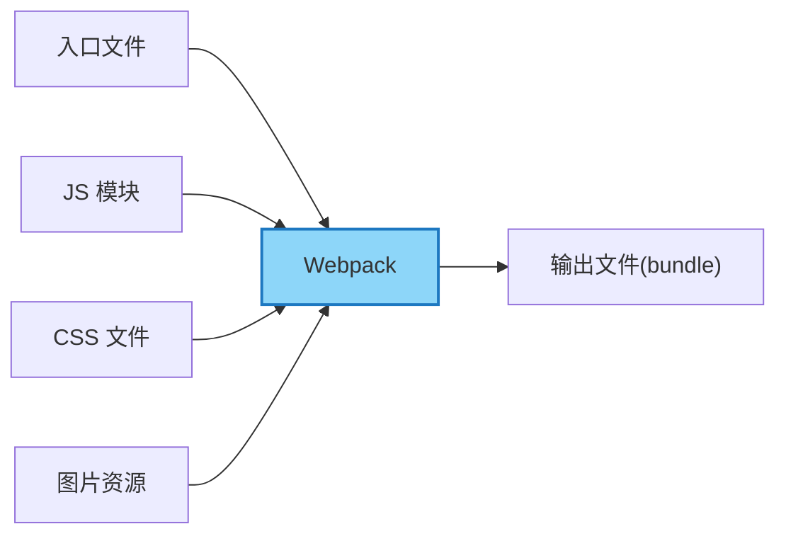
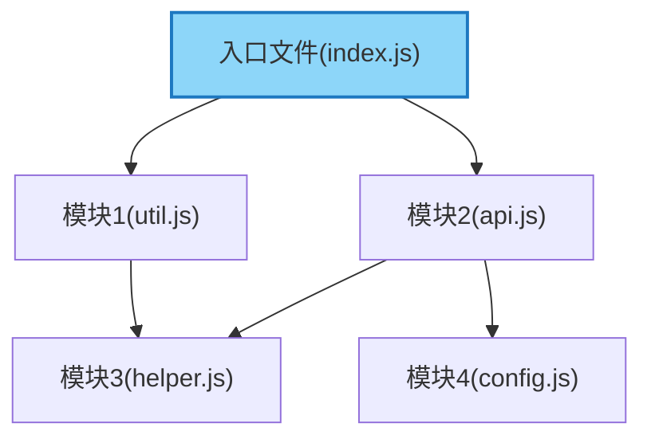
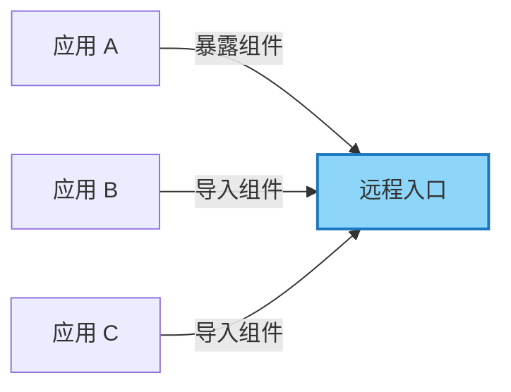
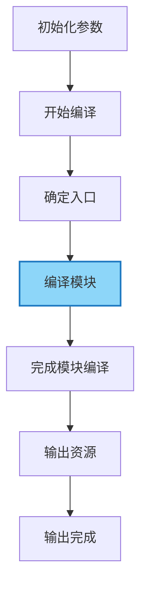
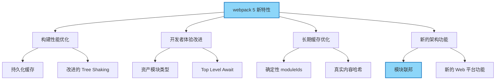

# Webpack Mochi 学习卡片

## 什么是 Webpack？

Tags: #Webpack #Webpack/Beginner #Webpack/Concept #Webpack/Core

---

Webpack 是一个现代 JavaScript 应用程序的{{静态模块打包工具}}。当 webpack 处理应用程序时，它会在内部构建一个{{依赖图}}，此{{依赖图}}对应映射到项目所需的每个{{模块}}，然后生成一个或多个 {{bundle}}。

> [!NOTE]
> 费曼式解释：想象你有很多散落的乐高积木（JavaScript 文件、CSS、图片等），每个积木都有特定的用途。Webpack 就像一个助手，它知道哪些积木需要连接在一起，并按照你的指示将它们组装成一个完整的玩具（打包后的应用）。它不仅仅是简单地把积木堆在一起，还会按照正确的顺序和结构组装，确保最终的玩具能够正常工作。



***

## 什么是依赖图（Dependency Graph）？

Tags: #Webpack #Webpack/Beginner #Webpack/Concept #Webpack/Core

---

在 Webpack 中，依赖图是指从{{入口点}}开始，webpack {{递归地}}构建一个包含应用程序所需的每个{{模块}}的关系图。每当一个文件依赖于另一个文件时，webpack 都会将此视为{{依赖关系}}，并根据这些依赖关系构建出完整的模块关系网络。

> [!NOTE]
> 费曼式解释：想象一个家族树，显示了谁是谁的父母、兄弟姐妹等。依赖图就像是你的代码文件的"家族树"。如果文件 A 需要使用文件 B 中的某些内容，那么文件 A 就"依赖于"文件 B。Webpack 会查看你的"主文件"（入口点），然后找出它依赖的所有文件，再找出这些文件依赖的所有文件，以此类推，直到构建出完整的"家族树"。



***

## 什么是 Bundle？

Tags: #Webpack #Webpack/Beginner #Webpack/Concept #Webpack/Core

---

Bundle（包）是由多个不同的{{模块}}生成，它是已经{{加载完毕}}和{{编译处理}}后的源代码的最终版本。与开发时编写的源码文件相比，bundle 文件是经过{{打包优化}}后的、可以直接在浏览器中运行的代码文件。

> [!NOTE]
> 费曼式解释：想象你写了一本书，由多个章节组成，每个章节保存在不同的文件中。Bundle 就像是将这些章节合并、编辑和优化后形成的最终出版物。读者（浏览器）不需要关心这本书最初是如何分散编写的，他们只需要阅读最终成型的完整作品。

***

## 什么是入口点（Entry Point）？

Tags: #Webpack #Webpack/Beginner #Webpack/Concept #Webpack/Core

---

入口点指示 webpack 应该使用哪个{{模块}}来作为构建其内部{{依赖图}}的开始。webpack 会找出入口点{{直接}}或{{间接}}依赖的所有模块。

可以在 webpack 配置中指定一个或多个入口点：

```javascript
module.exports = {
  entry: './path/to/my/entry/file.js'
};
```

> [!NOTE]
> 费曼式解释：入口点就像是一本书的目录页。当你想了解这本书时，通常会从目录开始，然后根据目录找到你感兴趣的章节。webpack 也是如此，它从你指定的入口文件开始，然后根据文件中的引用关系，找出所有需要包含在最终打包结果中的文件。

***

## 什么是输出（Output）？

Tags: #Webpack #Webpack/Beginner #Webpack/Concept #Webpack/Core

---

output 属性告诉 webpack 在{{哪里}}输出它所创建的 bundle，以及如何{{命名}}这些文件。主要输出文件的默认值是 {{`./dist/main.js`}}，其他生成文件默认放置在 {{`./dist`}} 文件夹中。

你可以在配置中指定输出配置：

```javascript
const path = require('path');

module.exports = {
  entry: './path/to/my/entry/file.js',
  output: {
    path: path.resolve(__dirname, 'dist'),
    filename: 'my-webpack-bundle.js'
  }
};
```

> [!NOTE]
> 费曼式解释：如果把 webpack 比作一个烘焙工厂，那么输出配置就是告诉工厂，烘焙好的面包（打包好的代码）应该放在哪个货架上（哪个文件夹），以及这个面包应该叫什么名字（文件名）。这样，当顾客（浏览器）来购买时，就能准确找到他们需要的产品。

***

## 什么是 Loader？

Tags: #Webpack #Webpack/Beginner #Webpack/Concept #Webpack/Loader

---

loader 让 webpack 能够去处理那些{{非 JavaScript 文件}}（webpack 自身只理解 JavaScript）。loader 可以将所有类型的文件{{转换}}为 webpack 能够处理的{{有效模块}}，然后你就可以利用 webpack 的打包能力，对它们进行处理。

本质上，webpack loader 将所有类型的文件，转换为应用程序的{{依赖图}}可以直接引用的模块。

```javascript
module.exports = {
  module: {
    rules: [
      { test: /\.css$/, use: 'css-loader' },
      { test: /\.ts$/, use: 'ts-loader' }
    ]
  }
};
```

> [!NOTE]
> 费曼式解释：想象 webpack 是一家只懂英语的翻译公司，而你的项目中有各种语言的文档（JavaScript、CSS、图片等）。Loader 就像是各种语言的翻译员，它们能够将非英语文档（非 JavaScript 文件）翻译成英语（JavaScript），这样翻译公司（webpack）就能理解并处理这些文档了。

***

## 什么是插件（Plugin）？

Tags: #Webpack #Webpack/Beginner #Webpack/Concept #Webpack/Plugin

---

插件是 webpack 的{{支柱功能}}。webpack 自身也是构建于{{插件系统}}之上！插件目的在于解决 loader {{无法实现}}的其他事。

webpack 插件是一个具有 `{{apply}}` 方法的 JavaScript 对象。`apply` 方法会被 webpack {{compiler}}调用，并且在整个{{编译生命周期}}都可以访问 compiler 对象。

```javascript
const HtmlWebpackPlugin = require('html-webpack-plugin');

module.exports = {
  plugins: [
    new HtmlWebpackPlugin({
      template: './src/index.html'
    })
  ]
};
```

> [!NOTE]
> 费曼式解释：如果把 webpack 比作一个汽车制造工厂，那么 loader 就像是生产线上的工人，负责将原材料（各种文件）加工成标准零件。而插件则像是工厂里的各种自动化设备和管理系统，它们不直接处理零件，但能优化整个生产流程，比如自动测试、质量检查、打包装箱等，确保最终产品符合要求且生产效率最高。

***

## 什么是模式（Mode）？

Tags: #Webpack #Webpack/Beginner #Webpack/Concept #Webpack/Configuration

---

通过选择 `{{development}}`, `{{production}}` 或 `{{none}}` 之中的一个，来设置 `mode` 参数，你可以启用 webpack 内置在相应环境下的优化。默认值为 `{{production}}`。

```javascript
module.exports = {
  mode: 'production'
};
```

不同模式的区别：

- development：开启 {{NamedChunksPlugin}} 和 {{NamedModulesPlugin}}，方便调试
- production：开启多种{{优化插件}}，如代码压缩、作用域提升等
- none：不使用任何默认{{优化选项}}

> [!NOTE]
> 费曼式解释：模式就像是汽车的驾驶模式。在"城市模式"（development）下，汽车会优先考虑灵活性和舒适性，便于在城市中频繁启停；而在"高速模式"（production）下，汽车会优先考虑速度和燃油效率，适合长距离高速行驶。webpack 的模式也是类似的概念，开发模式优先考虑开发体验，而生产模式优先考虑性能和用户体验。

***

## 什么是模块（Module）？

Tags: #Webpack #Webpack/Beginner #Webpack/Concept #Webpack/Core

---

在模块化编程中，开发者将程序分解为功能{{离散}}的chunk（discrete chunks of functionality），并称之为模块。

每个模块都拥有小于完整程序的{{体积}}，使得验证、调试及测试变得轻而易举。精心编写的模块提供了可靠的{{抽象}}和{{封装}}界限，使得应用程序中每个模块都具有条理清楚的设计和明确的目的。

webpack 模块能够以各种方式表达它们的依赖关系：

- ES2015 `{{import}}` 语句
- CommonJS `{{require()}}` 语句
- AMD `{{define}}` 和 `{{require}}` 语句
- css/sass/less 文件中的 `{{@import}}` 语句
- 样式（`{{url(...)}}`)或 HTML 文件（`{{}}`)中的图片链接

> [!NOTE]
> 费曼式解释：模块就像是积木。每块积木都有特定的形状和功能，可以单独使用，也可以与其他积木组合构建更复杂的结构。在编程中，模块是具有特定功能的代码块，可以被导入到其他代码中重复使用。这种方式让我们可以把复杂的程序拆分成更小、更容易理解和维护的部分，就像用积木搭建复杂建筑一样。

***

## 什么是热模块替换（Hot Module Replacement）？

Tags: #Webpack #Webpack/Intermediate #Webpack/Concept #Webpack/Core

---

热模块替换（HMR - Hot Module Replacement）是 webpack 提供的最有用的功能之一。它允许在{{运行时}}更新所有类型的模块，而无需{{完全刷新}}页面。

启用 HMR：

```javascript
const webpack = require('webpack');

module.exports = {
  devServer: {
    hot: true
  },
  plugins: [
    new webpack.HotModuleReplacementPlugin()
  ]
};
```

> [!NOTE]
> 费曼式解释：想象你正在搭建一座乐高城堡，突然发现其中一块积木颜色不对。传统方式下，你需要拆掉整个城堡，更换那块积木，然后重新搭建。而热模块替换就像是一种魔法，它让你可以直接替换那一块有问题的积木，而不影响城堡的其他部分。在网页开发中，这意味着你可以修改代码后立即看到更改效果，而不必刷新整个页面，保留了当前的应用状态。


***

## 什么是代码分割（Code Splitting）？

Tags: #Webpack #Webpack/Intermediate #Webpack/Concept #Webpack/Optimization

---

代码分割是 webpack 中最引人注目的特性之一。此特性能够把代码分割成不同的{{包/块}}（bundle/chunk），然后可以{{按需加载}}或{{并行加载}}这些文件。代码分割可以用于获取更小的 bundle，以及控制资源加载{{优先级}}，如果使用合理，会极大影响加载时间。

有三种常用的代码分割方法：

1. {{入口起点}}：使用 `entry` 配置手动地分割代码
2. {{防止重复}}：使用 `SplitChunksPlugin` 去重和分离 chunk
3. {{动态导入}}：通过模块的内联函数调用来分割代码

```javascript
// 动态导入示例
import(/* webpackChunkName: "lodash" */ 'lodash').then(({ default: _ }) => {
  console.log(_.join(['Hello', 'webpack'], ' '));
});
```

> [!NOTE]
> 费曼式解释：想象你要去度假，如果把所有衣物和用品都塞进一个大行李箱，这个箱子会变得又重又难搬运。代码分割就像是把你的行李分装到几个小箱子里 - 一个放夏装，一个放冬装，一个放洗漱用品等。这样你可以只携带当前需要的箱子，其他的可以在需要时再取。在网页应用中，这意味着用户首次访问时只需下载核心功能所需的代码，其他功能的代码可以在用户实际使用时再加载，大大加快了初始加载速度。

***

## 什么是 Tree Shaking？

Tags: #Webpack #Webpack/Intermediate #Webpack/Concept #Webpack/Optimization

---

Tree Shaking 是一个术语，通常用于描述移除 JavaScript 上下文中的{{未引用代码}}（dead-code）。它依赖于 ES2015 模块语法的{{静态结构}}特性，例如 `{{import}}` 和 `{{export}}`。

在 webpack 中启用 Tree Shaking：

```javascript
// webpack.config.js
module.exports = {
  mode: 'production',
  optimization: {
    usedExports: true
  }
};

// package.json
{
  "sideEffects": false
}
```

> [!NOTE]
> 费曼式解释：想象一棵苹果树，上面有很多苹果，有些是新鲜的，有些是坏掉的。Tree Shaking 就像是摇晃这棵树，让坏掉的苹果（未使用的代码）掉落，只留下新鲜的苹果（实际使用的代码）。这样你的应用就不必携带那些永远不会用到的"坏苹果"，从而减小了最终包的体积，使应用加载更快、运行更高效。

***

## 什么是 babel-loader？

Tags: #Webpack #Webpack/Intermediate #Webpack/Usage #Webpack/Loader

---

babel-loader 是一个 webpack loader，它使用 {{Babel}} 转译 JavaScript 文件。这允许你使用最新的 JavaScript {{语法}}，而不必担心浏览器{{兼容性}}问题。

使用 babel-loader 的配置示例：

```javascript
module.exports = {
  module: {
    rules: [
      {
        test: /\.js$/,
        exclude: /node_modules/,
        use: {
          loader: 'babel-loader',
          options: {
            presets: ['@babel/preset-env']
          }
        }
      }
    ]
  }
};
```

> [!NOTE]
> 费曼式解释：想象你写了一封信，但收信人只懂古英语。babel-loader 就像是一位翻译，它可以把你用现代英语（新版 JavaScript）写的信翻译成古英语（旧版 JavaScript），这样收信人（旧浏览器）就能理解你的信了。这让你可以使用最新、最强大的语言特性进行开发，而不必担心兼容性问题。

***

## 什么是 css-loader 和 style-loader？

Tags: #Webpack #Webpack/Beginner #Webpack/Usage #Webpack/Loader

---

这两个 loader 通常一起使用，用于处理 CSS 文件：

- **css-loader**：解析 CSS 文件中的 {{`@import`}} 和 {{`url()`}} 等语法，并将 CSS 转换为 JavaScript {{模块}}
- **style-loader**：将 css-loader 处理后的 CSS 通过 {{`<style>`}} 标签插入到 HTML {{页面}}中

配置示例：

```javascript
module.exports = {
  module: {
    rules: [
      {
        test: /\.css$/,
        use: [
          'style-loader', // 将 CSS 注入到 DOM 中
          'css-loader'    // 解析 CSS 文件
        ]
      }
    ]
  }
};
```

注意：loader 的执行顺序是从{{右到左}}（或从{{下到上}}），因此 css-loader 会先执行，然后将结果传给 style-loader。

> [!NOTE]
> 费曼式解释：想象你要把一张写满规则的纸（CSS 文件）放到公告板上（网页）。css-loader 就像是翻译官，它负责理解纸上所有的规则和引用，将其翻译成 JavaScript 能理解的格式。而 style-loader 则像是负责张贴的人，它把翻译好的规则实际贴到公告板上，让所有人都能看到并遵循这些规则。

***

## 什么是文件 loader（file-loader、url-loader、raw-loader）？

Tags: #Webpack #Webpack/Beginner #Webpack/Usage #Webpack/Loader

---

这些 loader 用于处理各种类型的文件：

- **file-loader**：将文件{{输出}}到输出目录，并返回文件的 {{URL 路径}}
- **url-loader**：与 file-loader 类似，但可以将小于指定{{大小}}的文件转换为 {{Data URL}}
- **raw-loader**：将文件内容导入为{{字符串}}

配置示例：

```javascript
module.exports = {
  module: {
    rules: [
      {
        test: /\.(png|jpe?g|gif)$/i,
        use: [
          {
            loader: 'url-loader',
            options: {
              limit: 8192, // 8kb 以下的图片会转为 Data URL
              fallback: 'file-loader'
            }
          }
        ]
      },
      {
        test: /\.txt$/,
        use: 'raw-loader'
      }
    ]
  }
};
```

> [!NOTE]
> 费曼式解释：想象你在整理一本相册。file-loader 就像是把照片放进相册并记下页码，这样你就知道在哪里找到它们。url-loader 类似，但它会判断照片的大小 - 如果照片很小，它就直接把照片粘在索引卡上（转为 Data URL），而不是放入相册中；如果照片太大，它会像 file-loader 那样处理。raw-loader 则是把文件的内容直接抄写下来，而不是存储文件本身。

***

## 什么是 HTML Webpack Plugin？

Tags: #Webpack #Webpack/Beginner #Webpack/Usage #Webpack/Plugin

---

HtmlWebpackPlugin {{简化}}了 HTML 文件的创建，为你的 webpack 包提供服务。这对于在文件名中包含{{哈希值}}的 webpack bundle 尤其有用，因为插件可以自动将生成的所有 bundle {{注入}}到 HTML 文件中。

基本用法：

```javascript
const HtmlWebpackPlugin = require('html-webpack-plugin');

module.exports = {
  plugins: [
    new HtmlWebpackPlugin({
      title: '我的应用',
      template: './src/index.html'
    })
  ]
};
```

> [!NOTE]
> 费曼式解释：想象你在准备一场演讲，需要一份包含所有参考资料列表的讲稿。HtmlWebpackPlugin 就像是一位助手，它会自动创建这份讲稿（HTML 文件），并确保所有你需要的参考资料（JavaScript 和 CSS 文件）都被正确地列在讲稿中。它特别擅长处理那些文件名经常变化的情况（如带有哈希值的文件名），确保每次演讲前都能找到最新版本的参考资料。

***

## 什么是 webpack-dev-server？

Tags: #Webpack #Webpack/Beginner #Webpack/Usage #Webpack/Core

---

webpack-dev-server 提供了一个简单的 {{web 服务器}}，并且能够实时{{重新加载}}（live reloading）。它将打包后的文件保存在{{内存}}中，而不是写入磁盘，这使得开发过程中的变更能够{{快速反映}}出来。

基本配置：

```javascript
module.exports = {
  devServer: {
    contentBase: './dist',
    port: 8080,
    hot: true,
    open: true
  }
};
```

启动开发服务器：

```bash
npx webpack serve
```

> [!NOTE]
> 费曼式解释：webpack-dev-server 就像是一家提供"边吃边做"服务的餐厅。在普通餐厅，厨师需要先做完整个菜，再端给你吃（构建完成后再提供服务）；而在这家特殊餐厅，厨师会在食材准备好后立即送到你桌前，你不必等待整个菜做完。更棒的是，当食谱（源代码）变化时，厨师会立即更新你盘中的食物（自动刷新页面），让你总能尝到最新版本，极大提高了用餐（开发）体验。

***

## 什么是 DefinePlugin？

Tags: #Webpack #Webpack/Intermediate #Webpack/Usage #Webpack/Plugin

---

DefinePlugin 允许在{{编译时}}创建全局{{常量}}，这可能非常有用，尤其是在需要区分{{开发环境}}与{{生产环境}}时。

使用示例：

```javascript
const webpack = require('webpack');

module.exports = {
  plugins: [
    new webpack.DefinePlugin({
      'process.env.NODE_ENV': JSON.stringify('production'),
      'DEBUG': false,
      'VERSION': JSON.stringify('5fa3b9')
    })
  ]
};
```

> [!NOTE]
> 费曼式解释：想象你是一位建筑师，在设计图纸上写下了一些可变的尺寸，比如"如果是冬季，墙厚为40cm；如果是夏季，墙厚为30cm"。DefinePlugin 就像是在开工前确定了季节，并在所有图纸上将相应的变量替换为具体数值。在代码中，它允许你定义一些在编译时就确定的常量，比如当前环境是开发还是生产，这样你的代码就能根据不同环境表现出不同的行为。

***

## 什么是 SplitChunksPlugin？

Tags: #Webpack #Webpack/Intermediate #Webpack/Usage #Webpack/Plugin #Webpack/Optimization

---

SplitChunksPlugin 是 webpack 内置的一个插件，用于提取{{公共代码}}到单独的 {{chunk}} 中，避免在多个入口文件或动态导入的模块中{{重复}}的代码。

基本配置：

```javascript
module.exports = {
  optimization: {
    splitChunks: {
      chunks: 'all', // 对所有chunk都进行优化
      minSize: 30000, // 生成chunk的最小大小（以字节为单位）
      cacheGroups: {
        vendors: {
          test: /[\\/]node_modules[\\/]/,
          priority: -10
        },
        default: {
          minChunks: 2, // 至少被引用两次才会被提取
          priority: -20,
          reuseExistingChunk: true
        }
      }
    }
  }
};
```

> [!NOTE]
> 费曼式解释：想象你在出版多本书，发现有些章节在不同的书中都会用到。与其在每本书中都重复印刷这些章节，不如将它们单独印刷成一个"通用章节集"，然后在每本书中引用它。这样不仅节省了印刷成本，读者拥有多本书时也能更快地加载，因为"通用章节"只需下载一次。SplitChunksPlugin 就是做这个工作的 - 它找出不同文件中重复的代码，并将其提取到单独的文件中，避免重复加载。

***

## 什么是 MiniCssExtractPlugin？

Tags: #Webpack #Webpack/Intermediate #Webpack/Usage #Webpack/Plugin

---

MiniCssExtractPlugin 用于将 CSS {{提取}}到单独的文件中。它为每个包含 CSS 的 JS 文件创建一个 CSS 文件，并且支持 CSS 和 {{SourceMaps}} 的按需加载。

使用示例：

```javascript
const MiniCssExtractPlugin = require('mini-css-extract-plugin');

module.exports = {
  module: {
    rules: [
      {
        test: /\.css$/,
        use: [
          MiniCssExtractPlugin.loader, // 替代 style-loader
          'css-loader'
        ]
      }
    ]
  },
  plugins: [
    new MiniCssExtractPlugin({
      filename: '[name].[contenthash].css'
    })
  ]
};
```

> [!NOTE]
> 费曼式解释：想象你正在整理一本杂志，里面包含了文章（JavaScript）和设计元素（CSS）。通常情况下，设计元素会直接放在文章页面上（通过 style-loader 内联到 JS 中）。而 MiniCssExtractPlugin 就像是一个编辑助理，它会将所有的设计元素提取出来，放到一个单独的设计手册中（独立的 CSS 文件）。这样做的好处是读者在阅读文章时可以同时参考设计手册，而不是将设计细节混杂在文章中，使得加载更快、组织更清晰。

***

## 什么是 webpack 的缓存策略？

Tags: #Webpack #Webpack/Intermediate #Webpack/Usage #Webpack/Optimization

---

webpack 提供了多种缓存策略，通过改变输出文件的名称来利用浏览器的缓存机制，同时确保在文件内容变化时能够获取最新版本：

1. **输出文件名使用{{哈希}}**：

```javascript
module.exports = {
  output: {
    filename: '[name].[contenthash].js',
    path: path.resolve(__dirname, 'dist')
  }
};
```

2. **提取{{第三方库}}**：

```javascript
module.exports = {
  optimization: {
    runtimeChunk: 'single',
    splitChunks: {
      cacheGroups: {
        vendor: {
          test: /[\\/]node_modules[\\/]/,
          name: 'vendors',
          chunks: 'all'
        }
      }
    }
  }
};
```

3. **模块{{标识符}}**：

```javascript
module.exports = {
  optimization: {
    moduleIds: 'deterministic'
  }
};
```

> [!NOTE]
> 费曼式解释：想象你经营一家餐厅，为了提高效率，你决定对菜单进行编号。但问题是，每当你添加或删除一道菜时，所有菜品的编号都会变化，这会让常客感到困惑。webpack 的缓存策略就像是一个聪明的编号系统：它为每道菜（文件）分配一个基于内容的唯一编号（contenthash），只有当菜品配方（文件内容）变化时，编号才会变化。这样，常客（浏览器）就能立即知道哪些菜品是他们已经尝过的（可以使用缓存），哪些是新的或者更改过的（需要重新获取）。

***

## 什么是 webpack 中的 source map？

Tags: #Webpack #Webpack/Intermediate #Webpack/Usage #Webpack/Debugging

---

source map 是一种将{{编译}}、{{打包}}、{{压缩}}后的代码映射回{{原始源代码}}的技术。通过 source map，可以在生产环境中调试源码，而不是调试那些转换后的代码。

在 webpack 中，可以通过 `{{devtool}}` 选项来控制 source map 的生成：

```javascript
module.exports = {
  devtool: 'source-map' // 生产环境推荐
  // 或
  // devtool: 'eval-cheap-module-source-map' // 开发环境推荐
};
```

不同的 devtool 选项会影响构建和重建速度，主要有以下几类：

- {{eval}}：使用 eval 包裹模块代码，速度最快
- {{source-map}}：产生 .map 文件，最详细的 source map
- {{cheap}}：不包含列信息，也不包含 loader 的 source map
- {{module}}：包含 loader 的 source map（例如 babel 编译前的代码）
- {{inline}}：将 .map 作为 DataURL 嵌入

> [!NOTE]
> 费曼式解释：想象你有一本精装书的电子版，为了节省空间，电子版把所有段落都压缩在一起，没有章节分隔和页码。source map 就像是一个索引表，它记录了压缩版本中的每个字符对应原书中的哪一页哪一段。当你在阅读电子版时发现一个错误，有了这个索引表，你就能立即找到这个错误在原书中的确切位置，而不必在一大堆压缩文本中查找。在网页开发中，这让你能够在浏览器中看到实际的源代码，即使浏览器加载的是压缩优化后的代码。

## webpack 配置文件是什么？

Tags: #Webpack #Webpack/Beginner #Webpack/Usage #Webpack/Configuration

---

webpack 的配置文件是一个普通的 JavaScript {{文件}}，它会导出一个包含 webpack 配置的{{对象}}。webpack 会根据这个对象定义的{{属性}}来执行构建过程。

基本的配置文件示例：

```javascript
const path = require('path');

module.exports = {
  mode: 'development',
  entry: './src/index.js',
  output: {
    filename: 'bundle.js',
    path: path.resolve(__dirname, 'dist')
  },
  module: {
    rules: [
      {
        test: /\.css$/,
        use: ['style-loader', 'css-loader']
      }
    ]
  },
  plugins: []
};
```

> [!NOTE]
> 费曼式解释：webpack 配置文件就像是一份烹饪食谱。在这份食谱中，你指定了需要哪些原料（entry - 入口文件），最终要做成什么样的菜（output - 输出文件），以及在烹饪过程中需要用到哪些特殊工具和技巧（loaders 和 plugins）。厨师（webpack）会按照这份食谱一步步处理原料，最终做出符合你期望的菜肴（打包后的应用）。

***

## 什么是 webpack 的多入口配置？

Tags: #Webpack #Webpack/Intermediate #Webpack/Usage #Webpack/Configuration

---

webpack 允许指定{{多个}}入口点，这对于构建{{多页面应用}}或将代码分割成{{多个块}}非常有用。

多入口配置示例：

```javascript
module.exports = {
  entry: {
    main: './src/index.js',
    admin: './src/admin.js'
  },
  output: {
    filename: '[name].bundle.js',
    path: path.resolve(__dirname, 'dist')
  }
};
```

这将生成 `main.bundle.js` 和 `admin.bundle.js` 两个文件。

> [!NOTE]
> 费曼式解释：想象你是一位城市规划师，负责设计城市的交通系统。单入口配置就像是只有一个主要入口的城市，所有人都必须通过这个入口进入城市。而多入口配置则像是有多个入口的城市，不同类型的访客可以选择最适合他们的入口。例如，普通游客可以从南门进入游览区，而工作人员可以从北门直接进入办公区。这样的设计让每类人都能以最高效的方式到达自己的目的地，而不必经过不相关的区域。

***

## 什么是 webpack 的开发环境和生产环境配置？

Tags: #Webpack #Webpack/Intermediate #Webpack/Usage #Webpack/Environment

---

webpack 推荐为{{开发环境}}和{{生产环境}}创建不同的配置，以满足不同环境的需求：

- **开发环境**：注重{{开发体验}}，包括 source maps、热更新等
- **生产环境**：注重{{性能优化}}，包括代码压缩、分离等

常见的实现方式是创建三个配置文件：

1. `{{webpack.common.js}}`：公共配置
2. `{{webpack.dev.js}}`：开发环境特定配置
3. `{{webpack.prod.js}}`：生产环境特定配置

然后使用 `webpack-merge` 合并配置：

```javascript
// webpack.dev.js
const { merge } = require('webpack-merge');
const common = require('./webpack.common.js');

module.exports = merge(common, {
  mode: 'development',
  devtool: 'inline-source-map',
  devServer: {
    contentBase: './dist',
  }
});
```

```javascript
// webpack.prod.js
const { merge } = require('webpack-merge');
const common = require('./webpack.common.js');

module.exports = merge(common, {
  mode: 'production',
  devtool: 'source-map'
});
```

> [!NOTE]
> 费曼式解释：想象你有一辆汽车，这辆车可以调整为"城市模式"或"赛道模式"。在城市模式下，汽车会优化舒适性和易操控性；而在赛道模式下，则会优化速度和性能。webpack 的环境配置也是类似的概念 - 开发环境就像城市模式，优化了开发体验，方便调试和快速反馈；而生产环境则像赛道模式，优化了性能和用户体验，去除了所有调试辅助工具，使应用运行得更快、更高效。

***

## 什么是 webpack 的模块解析规则？

Tags: #Webpack #Webpack/Intermediate #Webpack/Concept #Webpack/Configuration

---

webpack 使用 {{enhanced-resolve}} 来解析文件路径。模块解析是指 webpack 如何找到模块代码。当 import 或 require 一个模块时，webpack 需要找到这个模块对应的文件。

webpack 的解析规则有三种：

1. **{{绝对路径}}**：直接使用给定的路径，不需要进一步解析
2. **{{相对路径}}**：相对于导入文件所在的目录进行解析
3. **{{模块路径}}**：在 `resolve.modules` 中指定的目录内查找模块

自定义解析行为：

```javascript
module.exports = {
  resolve: {
    // 尝试按顺序解析这些后缀名
    extensions: ['.js', '.jsx', '.json'],
    
    // 创建路径别名
    alias: {
      '@': path.resolve(__dirname, 'src')
    }
  }
};
```

> [!NOTE]
> 费曼式解释：模块解析就像是在图书馆找书。当你想要借阅一本书，你可能有不同的方式来描述这本书：给出确切的书架号和位置（绝对路径），告诉图书管理员这本书在某本书旁边（相对路径），或者只给出书名让管理员在目录系统中查找（模块路径）。webpack 的模块解析规则就定义了当你在代码中引用其他文件时，webpack 应该如何在文件系统中找到这些文件，就像图书馆的查找系统一样。

***

## 什么是 webpack 的 externals 配置？

Tags: #Webpack #Webpack/Intermediate #Webpack/Usage #Webpack/Configuration

---

externals 配置选项提供了不将某些 import 的包{{打包}}到 bundle 中的方式，而是在{{运行时}}再去从{{外部}}获取这些依赖。

常见场景是从 {{CDN}} 引入库文件：

```javascript
module.exports = {
  externals: {
    jquery: 'jQuery',
    react: 'React',
    'react-dom': 'ReactDOM'
  }
};
```

然后在 HTML 中通过 script 标签引入这些库：

```html
<script src="https://cdn.jsdelivr.net/npm/jquery@3.6.0/dist/jquery.min.js"></script>
<script src="https://cdn.jsdelivr.net/npm/react@17.0.2/umd/react.production.min.js"></script>
<script src="https://cdn.jsdelivr.net/npm/react-dom@17.0.2/umd/react-dom.production.min.js"></script>
```

> [!NOTE]
> 费曼式解释：想象你要制作一个菜谱书。对于一些基本的调料如盐和胡椒粉，你可以假设每个厨房都会有，所以没必要在菜谱中包含如何制作盐和胡椒粉的说明。externals 配置就是告诉 webpack："这些依赖项就像厨房里的盐和胡椒粉，它们将在'烹饪环境'（运行时）中可用，所以不需要把它们包含在我们的'菜谱书'（bundle）中。"这样可以减小打包文件的体积，并且可以利用浏览器缓存来提高加载速度。

***

## 什么是 webpack 的动态导入？

Tags: #Webpack #Webpack/Intermediate #Webpack/Usage #Webpack/Optimization

---

webpack 支持 {{ES2020}} 的动态导入语法，使你可以在代码中{{动态地}}加载模块。这是实现{{代码分割}}的推荐方式之一。

示例：

```javascript
// 静态导入
import { add } from './math';
console.log(add(1, 2));

// 动态导入
button.addEventListener('click', () => {
  import(/* webpackChunkName: "math" */ './math').then(({ add }) => {
    console.log(add(1, 2));
  }).catch(err => {
    console.error('加载模块失败:', err);
  });
});
```

通过使用魔法注释 `{{webpackChunkName}}`，可以为生成的块指定名称。

> [!NOTE]
> 费曼式解释：想象你在使用一本厚重的百科全书。静态导入就像是在开始阅读前就把整本书都放在桌上，即使你可能只需要查阅其中几页。而动态导入则像是先把书放在书架上，只有当你真正需要某个章节时，才从书架上取下那个特定章节阅读。这种方式可以让你的开始阅读（初始加载）变得更快，因为你不需要一开始就搬动整本厚重的书，只有在真正需要时才获取相应的内容。

***

## 什么是 webpack 的懒加载（Lazy Loading）？

Tags: #Webpack #Webpack/Intermediate #Webpack/Usage #Webpack/Optimization

---

懒加载是一种优化网页或应用的方式，它能够帮助减少{{初始加载}}时间，只有在实际{{需要}}时才加载某些部分。webpack 的懒加载主要通过{{动态导入}}来实现。

React 中的懒加载示例：

```javascript
import React, { Suspense, lazy } from 'react';
import { BrowserRouter as Router, Route, Switch } from 'react-router-dom';

// 懒加载组件
const Home = lazy(() => import('./routes/Home'));
const About = lazy(() => import('./routes/About'));

const App = () => (
  <Router>
    <Suspense fallback={<div>Loading...</div>}>
      <Switch>
        <Route exact path="/" component={Home} />
        <Route path="/about" component={About} />
      </Switch>
    </Suspense>
  </Router>
);
```

> [!NOTE]
> 费曼式解释：懒加载就像是按需订阅杂志。传统方式是一次性订阅整年的杂志，即使有些期刊你可能根本不会阅读，这会浪费金钱。而懒加载则是先不订阅，只有当你确实想读某一期时，才去单独购买那一期。在网页应用中，这意味着用户首次访问时只需下载必要的核心代码，其他功能的代码可以在用户实际访问到那些功能时再加载，极大减少了初始加载时间和资源消耗。

***

## 什么是 webpack 的持久化缓存？

Tags: #Webpack #Webpack/Advanced #Webpack/Usage #Webpack/Optimization

---

webpack 5 引入了持久化缓存功能，可以在{{磁盘}}上缓存生成的 webpack {{模块}}和{{块}}，大大提高了构建{{速度}}。

启用持久化缓存：

```javascript
module.exports = {
  cache: {
    type: 'filesystem', // 使用文件系统缓存
    buildDependencies: {
      config: [__filename] // 当配置文件变化时使缓存失效
    }
  }
};
```

> [!NOTE]
> 费曼式解释：想象你是一位建筑师，每次设计新建筑时都需要进行复杂的计算。传统方式下，每次设计新建筑都要重新进行所有计算，即使很多计算结果之前已经得出过。持久化缓存就像是你把每次计算的结果都记录在一本笔记本中，下次需要进行类似计算时，可以直接查阅笔记本获取结果，而不必从头再来。这大大加快了设计过程。webpack 的持久化缓存也是如此，它将构建过程中的中间结果保存在磁盘上，下次构建时如果相关文件没有变化，就可以直接使用缓存的结果，无需重新计算，从而显著提高构建速度。

***

## 什么是模块联邦（Module Federation）？

Tags: #Webpack #Webpack/Advanced #Webpack/Concept #Webpack/Integration

---

模块联邦是 webpack 5 的一个新特性，它允许多个{{独立构建}}的应用{{共享}}代码。这使得{{微前端}}架构变得更加容易实现。

基本配置示例：

```javascript
// 应用 A 配置
const { ModuleFederationPlugin } = require('webpack').container;

module.exports = {
  plugins: [
    new ModuleFederationPlugin({
      name: 'app_a',
      filename: 'remoteEntry.js',
      exposes: {
        './Button': './src/components/Button'
      },
      shared: ['react', 'react-dom']
    })
  ]
};

// 应用 B 配置
const { ModuleFederationPlugin } = require('webpack').container;

module.exports = {
  plugins: [
    new ModuleFederationPlugin({
      name: 'app_b',
      remotes: {
        app_a: 'app_a@http://localhost:3001/remoteEntry.js'
      },
      shared: ['react', 'react-dom']
    })
  ]
};
```

在应用 B 中使用应用 A 暴露的组件：

```javascript
// 动态导入联邦模块
const Button = React.lazy(() => import('app_a/Button'));

function App() {
  return (
    <div>
      <React.Suspense fallback="Loading Button">
        <Button />
      </React.Suspense>
    </div>
  );
}
```

> [!NOTE]
> 费曼式解释：模块联邦就像是城市间的贸易系统。传统上，每个城市（应用）都需要自给自足，生产自己需要的所有物品。而有了贸易系统后，城市可以专注于生产自己擅长的物品，并与其他城市交换它们所擅长生产的物品。这样每个城市都能获得更高质量、更多样化的商品，同时降低了生产成本。在前端开发中，模块联邦允许不同的应用团队独立开发和部署他们的代码，同时还能轻松地共享和重用彼此的组件，这极大地提高了开发效率和代码质量。



***

## 什么是 webpack 中的资产模块（Asset Modules）？

Tags: #Webpack #Webpack/Intermediate #Webpack/Usage #Webpack/Core

---

webpack 5 引入了资产模块（Asset Modules），它是一种{{模块类型}}，允许使用资源文件（字体，图标等）而无需配置{{额外}}的 loader。

资产模块类型：

- `{{asset/resource}}` - 发送一个单独的文件并导出 URL（类似 file-loader）
- `{{asset/inline}}` - 导出资源的 data URI（类似 url-loader）
- `{{asset/source}}` - 导出资源的源代码（类似 raw-loader）
- `{{asset}}` - 在导出单独文件和导出 data URI 之间自动选择（类似 url-loader 的 limit 配置）

示例配置：

```javascript
module.exports = {
  module: {
    rules: [
      {
        test: /\.png$/,
        type: 'asset/resource'
      },
      {
        test: /\.svg$/,
        type: 'asset/inline'
      },
      {
        test: /\.txt$/,
        type: 'asset/source'
      },
      {
        test: /\.jpg$/,
        type: 'asset',
        parser: {
          dataUrlCondition: {
            maxSize: 4 * 1024 // 4kb
          }
        }
      }
    ]
  }
};
```

> [!NOTE]
> 费曼式解释：资产模块就像是一套统一的包装标准。在超市里，不同类型的产品通常需要不同的包装方式：液体需要瓶子，固体食品需要盒子或袋子。传统上，webpack 也需要为不同类型的资源使用不同的 loader 进行"包装"。而资产模块就像是一种万能包装系统，可以自动根据产品特性选择最合适的包装方式，大大简化了包装过程。这让开发者不再需要为每种资源类型配置专门的 loader，而是使用内置的统一解决方案，使配置更简洁、更一致。

***

## 什么是 webpack 的工作原理？

Tags: #Webpack #Webpack/Advanced #Webpack/Principle #Webpack/Core

---

webpack 的工作原理可以概括为以下步骤：

1. **{{初始化参数}}**：从配置文件和命令行参数中读取并合并参数，得到最终的配置对象
2. **{{开始编译}}**：用上一步得到的配置初始化 Compiler 对象，加载所有配置的插件，执行 Compiler 对象的 run 方法开始编译
3. **{{确定入口}}**：根据配置中的 entry 找出所有的入口文件
4. **{{编译模块}}**：从入口文件出发，调用所有配置的 loader 对模块进行转换，再找出该模块依赖的模块，递归地进行编译处理
5. **{{完成模块编译}}**：经过第 4 步使用 loader 转换完所有模块后，得到了每个模块被转换后的最终内容以及它们之间的依赖关系
6. **{{输出资源}}**：根据入口和模块之间的依赖关系，组装成一个个包含多个模块的 chunk，再把每个 chunk 转换成一个单独的文件加入到输出列表
7. **{{输出完成}}**：根据配置确定输出的路径和文件名，把文件内容写入到文件系统

> [!NOTE]
> 费曼式解释：想象 webpack 是一家工厂。首先，工厂管理员查看生产清单（配置文件），了解需要生产什么、如何生产。然后，工厂启动并装载所有必要的机器（插件）。接着，原材料（入口文件）被送入生产线。在生产线上，不同的专业工人（loader）对材料进行加工处理，并检查每种材料是否需要其他材料（依赖）。如果需要，这些新材料也会被送入生产线。当所有材料都加工完成后，工厂开始按照生产计划将这些处理过的材料组装成产品（chunk）。最后，包装好的产品被送到指定的仓库（输出目录）中，等待运输。这整个过程就是 webpack 如何将你的源代码转变为可部署的应用程序的工作原理。



***

## 什么是 webpack 的构建性能优化策略？

Tags: #Webpack #Webpack/Advanced #Webpack/Usage #Webpack/Optimization

---

提高 webpack 构建性能的常用策略包括：

1. **减少 loader {{作用范围}}**：

```javascript
module.exports = {
  module: {
    rules: [
      {
        test: /\.js$/,
        include: path.resolve(__dirname, 'src'), // 只处理 src 目录
        loader: 'babel-loader'
      }
    ]
  }
};
```

2. **使用 {{DllPlugin}} 分离第三方库**：

```javascript
// webpack.dll.config.js
module.exports = {
  entry: {
    vendor: ['react', 'react-dom', 'lodash']
  },
  output: {
    filename: '[name].dll.js',
    path: path.resolve(__dirname, 'dll'),
    library: '[name]_library'
  },
  plugins: [
    new webpack.DllPlugin({
      name: '[name]_library',
      path: path.resolve(__dirname, 'dll/[name]-manifest.json')
    })
  ]
};
```

3. **使用 {{thread-loader}} 并行处理**：

```javascript
module.exports = {
  module: {
    rules: [
      {
        test: /\.js$/,
        use: [
          'thread-loader',
          'babel-loader'
        ]
      }
    ]
  }
};
```

4. **启用{{持久化缓存}}**：

```javascript
module.exports = {
  cache: {
    type: 'filesystem'
  }
};
```

5. **优化{{解析配置}}**：

```javascript
module.exports = {
  resolve: {
    extensions: ['.js', '.json'], // 只查找这些后缀
    modules: [path.resolve(__dirname, 'src'), 'node_modules'] // 指定查找目录
  }
};
```

> [!NOTE]
> 费曼式解释：构建性能优化就像是提高工厂生产效率。你可以限制每个工人（loader）只负责处理特定类型的材料（include/exclude），预先加工并储存一些常用部件（DllPlugin），增加工人数量并行工作（thread-loader），记录之前的生产结果以避免重复工作（cache），以及优化材料存放方式使查找更快（resolve 优化）。这些措施共同作用，可以显著提高工厂（webpack）的生产速度，让产品（打包结果）更快地面世。

***

## 什么是 webpack 的运行时性能优化策略？

Tags: #Webpack #Webpack/Advanced #Webpack/Usage #Webpack/Optimization

---

webpack 提供了多种优化最终打包结果运行性能的策略：

1. **{{代码分割}}**：

```javascript
module.exports = {
  optimization: {
    splitChunks: {
      chunks: 'all'
    }
  }
};
```

2. **{{懒加载}}**：

```javascript
// 点击按钮时才加载代码
button.addEventListener('click', () => {
  import('./module.js').then(module => {
    module.doSomething();
  });
});
```

3. **{{Tree Shaking}}**：

```javascript
// webpack.config.js
module.exports = {
  mode: 'production',
  optimization: {
    usedExports: true
  }
};

// package.json
{
  "sideEffects": false // 或 ["*.css"] 排除有副作用的文件
}
```

4. **{{压缩代码}}**：

```javascript
const TerserPlugin = require('terser-webpack-plugin');

module.exports = {
  optimization: {
    minimize: true,
    minimizer: [new TerserPlugin()]
  }
};
```

5. **{{预取/预加载}}模块**：

```javascript
// 预加载示例
import(/* webpackPrefetch: true */ './path/to/LoginModal.js');
```

> [!NOTE]
> 费曼式解释：想象你正在优化一本大型百科全书的使用体验。代码分割就像是将百科全书分成多个小册子，读者可以只拿取他们需要的部分；懒加载则是只有当读者翻到特定章节时才印刷该章节；Tree Shaking 相当于删除没人会读的条目；压缩代码就像是使用更小的字体和更紧凑的排版；而预取/预加载就像是猜测读者接下来可能会查阅哪个章节，并提前将这些章节准备好。这些技术共同作用，使得这本百科全书（你的应用）变得更轻便、更快速，提供更好的用户体验。

***

## 如何使用 webpack 进行 CSS 的拆分和优化？

Tags: #Webpack #Webpack/Intermediate #Webpack/Usage #Webpack/Optimization

---

webpack 可以通过特定的{{插件}}和 {{loader}} 来拆分和优化 CSS：

1. **提取 CSS 到{{单独文件}}**：

```javascript
const MiniCssExtractPlugin = require('mini-css-extract-plugin');

module.exports = {
  module: {
    rules: [
      {
        test: /\.css$/,
        use: [
          MiniCssExtractPlugin.loader, // 替代 style-loader
          'css-loader'
        ]
      }
    ]
  },
  plugins: [
    new MiniCssExtractPlugin({
      filename: '[name].[contenthash].css'
    })
  ]
};
```

2. **{{压缩}} CSS**：

```javascript
const CssMinimizerPlugin = require('css-minimizer-webpack-plugin');

module.exports = {
  optimization: {
    minimizer: [
      new CssMinimizerPlugin()
    ]
  }
};
```

3. **CSS {{模块化}}**：

```javascript
module.exports = {
  module: {
    rules: [
      {
        test: /\.css$/,
        use: [
          'style-loader',
          {
            loader: 'css-loader',
            options: {
              modules: true
            }
          }
        ]
      }
    ]
  }
};
```

4. **{{PostCSS}} 优化**：

```javascript
module.exports = {
  module: {
    rules: [
      {
        test: /\.css$/,
        use: [
          'style-loader',
          'css-loader',
          {
            loader: 'postcss-loader',
            options: {
              postcssOptions: {
                plugins: [
                  'postcss-preset-env',
                  'autoprefixer'
                ]
              }
            }
          }
        ]
      }
    ]
  }
};
```

> [!NOTE]
> 费曼式解释：CSS 优化就像是整理一个大衣柜。首先，你可能想把所有的衣服按类型分开存放（提取 CSS 到单独文件）；然后，你会想方设法让每件衣服占用尽可能少的空间，比如叠放或真空压缩（压缩 CSS）；接着，你可能想建立一个系统，确保不同类型的衣服不会混在一起（CSS 模块化）；最后，你可能会使用一些特殊的收纳工具来让衣柜更有条理（PostCSS 优化）。这些措施共同作用，使得你的衣柜（CSS 文件）更加有组织、高效且易于管理。

***

## 什么是 webpack 的查找算法？

Tags: #Webpack #Webpack/Advanced #Webpack/Principle #Webpack/Core

---

webpack 使用 enhanced-resolve 来解析模块路径，其主要查找规则如下：

1. **{{绝对路径}}**：

   ```javascript
   import '/home/me/file';
   import 'C:\\Users\\me\\file';
   ```

   直接使用给定的路径，不需要进一步解析。

2. **{{相对路径}}**：

   ```javascript
   import './file';
   import '../file';
   ```

   相对于导入文件所在的目录进行解析。

3. **{{模块路径}}**：

   ```javascript
   import 'module';
   import 'module/lib/file';
   ```

   在配置的 `resolve.modules` 目录中查找，默认是 `{{['node_modules']}}`。查找过程会尝试以下路径：
   - `/path/to/file` 的 `node_modules`
   - `/path/to` 的 `node_modules`
   - `/path` 的 `node_modules`
   - `/` 的 `node_modules`

4. **{{resolve.alias}} 配置的路径别名**：

   ```javascript
   // webpack.config.js
   module.exports = {
     resolve: {
       alias: {
         '@': path.resolve(__dirname, 'src')
       }
     }
   };
   
   // 在代码中使用
   import '@/components/Button';
   ```

5. **{{resolve.extensions}} 定义的文件扩展名**：
   如果文件没有指定扩展名，webpack 会按照 `resolve.extensions` 中定义的扩展名顺序查找文件。

> [!NOTE]
> 费曼式解释：webpack 的查找算法就像是一个图书馆的查找系统。如果你知道书的确切位置（绝对路径），图书管理员就会直接前往那个位置；如果你只知道书在某本书旁边（相对路径），管理员会从那个参考点开始查找；如果你只知道书名（模块路径），管理员会按照一定的顺序检查各个书架，直到找到这本书；如果你使用了图书馆的分类别名（resolve.alias），管理员会按照这个别名对应的实际位置查找；最后，如果你不确定书的具体形态（文件扩展名），管理员会按照预定的顺序查找可能的形态（精装本、平装本等）。这一系列规则确保了无论你如何描述你想要的模块，webpack 都能尽可能地找到它。

***

## 如何使用 webpack 的 DLL 功能优化构建性能？

Tags: #Webpack #Webpack/Advanced #Webpack/Usage #Webpack/Optimization

---

DLL（动态链接库）功能可以将特定的{{第三方库}}提前打包，减少{{构建时间}}。这需要两步配置：

1. **创建 DLL {{文件}}**：

```javascript
// webpack.dll.config.js
const path = require('path');
const webpack = require('webpack');

module.exports = {
  mode: 'production',
  entry: {
    vendor: ['react', 'react-dom', 'lodash'] // 需要提前打包的库
  },
  output: {
    path: path.join(__dirname, 'dll'),
    filename: '[name].dll.js',
    library: '[name]_library' // 暴露给外部使用的变量名
  },
  plugins: [
    new webpack.DllPlugin({
      name: '[name]_library',
      path: path.join(__dirname, 'dll', '[name]-manifest.json')
    })
  ]
};
```

2. **在主配置文件中{{引用}} DLL**：

```javascript
// webpack.config.js
const webpack = require('webpack');
const path = require('path');

module.exports = {
  plugins: [
    new webpack.DllReferencePlugin({
      manifest: require('./dll/vendor-manifest.json')
    })
  ]
};
```

> [!NOTE]
> 费曼式解释：DLL 功能就像是烹饪中的准备工作。想象你要做几道不同的菜，但它们都需要同样的高汤底料。与其每次做菜都重新熬制高汤（每次构建都重新打包第三方库），不如提前熬好一大锅高汤（DLL 文件），然后在做各道菜时直接使用这个现成的高汤。这样，你每次做菜（构建项目）的时间就大大缩短了，因为最耗时的部分已经提前完成。DLL 功能正是利用这一思想，将那些不常变动的第三方库提前打包，避免在每次构建时重复处理这些库。

***

## 如何调试 webpack 打包过程？

Tags: #Webpack #Webpack/Advanced #Webpack/Usage #Webpack/Debugging

---

可以采用以下几种方法来调试 webpack 的构建过程：

1. **使用 {{stats}} 数据**：

```javascript
// webpack.config.js
module.exports = {
  // ...
  stats: 'verbose'
};
```

2. **使用 `{{--progress}}` 标志**：

```bash
webpack --progress
```

3. **使用 Node.js {{调试器}}**：

```javascript
// 在 webpack 配置文件中添加调试点
debugger;
module.exports = {
  // ...
};
```

然后使用以下命令启动：

```bash
node --inspect-brk ./node_modules/webpack/bin/webpack.js
```

4. **分析构建{{产物}}**：

```javascript
const { BundleAnalyzerPlugin } = require('webpack-bundle-analyzer');

module.exports = {
  plugins: [
    new BundleAnalyzerPlugin()
  ]
};
```

5. **启用 {{profile}}**：

```bash
webpack --profile --json > stats.json
```

然后可以在 [webpack 分析工具](https://webpack.github.io/analyse/) 中上传 stats.json 文件进行分析。

> [!NOTE]
> 费曼式解释：调试 webpack 打包过程就像是解决一辆复杂机器运转不畅的问题。你可以查看机器运行的详细日志（stats 数据），观察机器工作的进度条（--progress），停下机器在特定点检查（Node.js 调试器），分析机器产出的产品质量（Bundle Analyzer），或者获取机器的详细性能报告（profile）。这些工具共同帮助你理解 webpack 这台"打包机器"的内部工作原理，找出性能瓶颈或错误所在，从而进行有针对性的优化和修复。

***

## 如何编写一个自定义 webpack loader？

Tags: #Webpack #Webpack/Advanced #Webpack/Principle #Webpack/Loader

---

webpack loader 是一个导出为{{函数}}的 JavaScript 模块，它接收源文件内容作为{{参数}}，返回转换后的内容。

创建一个简单的 reverse-loader，用于反转源代码中的字符串：

```javascript
// reverse-loader.js
module.exports = function(source) {
  // source 是源文件内容（字符串）
  const reversed = source
    .split('')
    .reverse()
    .join('');
  
  // 返回转换后的内容
  return `export default ${JSON.stringify(reversed)}`;
};
```

使用自定义 loader：

```javascript
// webpack.config.js
module.exports = {
  module: {
    rules: [
      {
        test: /\.txt$/,
        use: [
          {
            loader: path.resolve('./loaders/reverse-loader.js')
          }
        ]
      }
    ]
  }
};
```

支持{{选项}}的 loader：

```javascript
// options-loader.js
const { getOptions } = require('loader-utils');
const { validate } = require('schema-utils');

const schema = {
  type: 'object',
  properties: {
    prefix: {
      type: 'string'
    }
  }
};

module.exports = function(source) {
  // 获取配置选项
  const options = getOptions(this) || {};
  
  // 验证选项
  validate(schema, options, {
    name: 'Options Loader'
  });
  
  // 添加前缀
  const prefix = options.prefix || '';
  return `export default ${JSON.stringify(prefix + source)}`;
};
```

> [!NOTE]
> 费曼式解释：编写一个 webpack loader 就像是设计一个特殊的翻译机。这个翻译机接收一种语言的文本（源代码），进行某种处理或转换，然后输出另一种语言的文本（webpack 可以理解的 JavaScript）。就像一个将英语翻译成法语的翻译器，loader 可以将 CSS、图片或其他资源"翻译"成 JavaScript 模块。你可以创建自己的翻译规则，比如将所有单词倒序排列，或者在文本前添加特定前缀。这种灵活性使得 webpack 能够处理各种类型的文件，远超出 JavaScript 的范围。

***

## 如何编写一个自定义 webpack 插件？

Tags: #Webpack #Webpack/Advanced #Webpack/Principle #Webpack/Plugin

---

webpack 插件是一个具有 `{{apply}}` 方法的 JavaScript {{对象}}，该方法会在 webpack 初始化时被调用，并赋予对整个{{编译过程}}的访问权限。

一个简单的文件列表插件示例：

```javascript
// FileListPlugin.js
class FileListPlugin {
  constructor(options) {
    this.filename = options && options.filename ? options.filename : 'filelist.md';
  }
  
  apply(compiler) {
    // 监听 emit 钩子
    compiler.hooks.emit.tapAsync('FileListPlugin', (compilation, callback) => {
      // 创建文件列表
      let filelist = '# 文件列表\n\n';
      
      // 遍历所有编译好的资源
      for (let filename in compilation.assets) {
        filelist += `- ${filename}\n`;
      }
      
      // 将文件列表作为新的资源添加到 webpack
      compilation.assets[this.filename] = {
        source: function() {
          return filelist;
        },
        size: function() {
          return filelist.length;
        }
      };
      
      callback();
    });
  }
}

module.exports = FileListPlugin;
```

使用自定义插件：

```javascript
// webpack.config.js
const FileListPlugin = require('./plugins/FileListPlugin');

module.exports = {
  plugins: [
    new FileListPlugin({
      filename: 'files.md'
    })
  ]
};
```

> [!NOTE]
> 费曼式解释：webpack 插件就像是工厂流水线上的特殊工作站。普通工作站（loader）负责处理单个产品，而插件则可以监控和干预整个生产过程的不同阶段。例如，你可以创建一个工作站，它不直接处理产品，而是在生产结束前统计所有产品的信息并生成一份报告。webpack 插件也是如此，它们可以钩入 webpack 的各个生命周期事件（如编译开始、模块解析、资源优化、输出前等），执行特定任务或修改编译结果。这种能力使插件成为扩展和自定义 webpack 行为的强大工具。


***

## webpack 的钩子（hooks）系统是什么？

Tags: #Webpack #Webpack/Advanced #Webpack/Principle #Webpack/Plugin

---

webpack 使用 [{{tapable}}](https://github.com/webpack/tapable) 库提供了一套钩子（hooks）系统，这些钩子允许插件在 webpack 构建流程的特定{{时刻}}注入自定义行为。

主要钩子类型：

- **{{SyncHook}}**：同步钩子，按照注册顺序依次执行
- **{{SyncBailHook}}**：同步钩子，如果有插件返回非 undefined 值，则跳过剩余插件
- **{{SyncWaterfallHook}}**：同步钩子，上一个插件的返回值作为下一个插件的参数
- **{{SyncLoopHook}}**：同步钩子，如果插件返回非 undefined 值，则重新执行该插件
- **{{AsyncParallelHook}}**：异步钩子，并行执行
- **{{AsyncSeriesHook}}**：异步钩子，按照注册顺序依次执行

常用的 compiler 钩子：

- **{{entryOption}}**：在 webpack 配置中的 entry 被处理后调用
- **{{afterPlugins}}**：设置插件之后调用
- **{{compile}}**：在创建新的编译时调用
- **{{make}}**：编译阶段开始时调用
- **{{emit}}**：资源即将写入输出目录时调用
- **{{done}}**：编译完成时调用

示例：在构建结束后显示耗时信息的插件

```javascript
class BuildTimePlugin {
  apply(compiler) {
    // 记录开始时间
    let startTime;
    
    // 在编译开始时记录时间
    compiler.hooks.compile.tap('BuildTimePlugin', () => {
      startTime = Date.now();
      console.log('编译开始...');
    });
    
    // 在编译结束后计算耗时
    compiler.hooks.done.tap('BuildTimePlugin', stats => {
      const endTime = Date.now();
      const buildTime = endTime - startTime;
      console.log(`编译完成！总耗时: ${buildTime}ms`);
    });
  }
}
```

> [!NOTE]
> 费曼式解释：webpack 的钩子系统就像是一场马拉松比赛中的补给站。比赛组织者（webpack）在赛道上设置了多个补给站（hooks），参赛者（数据）会依次经过这些站点。志愿者（插件）可以在特定的补给站注册，当参赛者到达时，这些志愿者可以为他们提供水和食物（处理数据）。有些补给站允许多个志愿者同时工作（并行钩子），有些则要求志愿者按顺序工作（串行钩子）。钩子系统确保了志愿者能在恰当的时机提供帮助，同时不会干扰比赛的整体流程。这种机制使得 webpack 能够在保持核心功能稳定的同时，支持丰富的扩展和自定义行为。

***

## 什么是 webpack 的作用域提升（Scope Hoisting）？

Tags: #Webpack #Webpack/Advanced #Webpack/Principle #Webpack/Optimization

---

作用域提升（Scope Hoisting）是 webpack 的一个优化功能，它允许 webpack 将模块的{{作用域}}提升到一个更高的作用域，从而减少{{函数声明}}和{{间接调用}}，提高代码{{执行效率}}。

在 webpack 4+ 中，当 mode 设置为 '{{production}}' 时，作用域提升会自动启用。在 webpack 3 中，需要手动添加 {{ModuleConcatenationPlugin}} 插件：

```javascript
const webpack = require('webpack');

module.exports = {
  plugins: [
    new webpack.optimize.ModuleConcatenationPlugin()
  ]
};
```

作用域提升前后的代码对比：

**提升前**（多个模块函数）：

```javascript
// module1.js
export const value = 'Hello';

// module2.js
import { value } from './module1.js';
export function printValue() {
  console.log(value);
}

// 打包后（简化表示）
[
  /* 0 */ function(module, exports, __webpack_require__) {
    exports.value = 'Hello';
  },
  /* 1 */ function(module, exports, __webpack_require__) {
    const value = __webpack_require__(0).value;
    exports.printValue = function() {
      console.log(value);
    };
  }
]
```

**提升后**（单个函数）：

```javascript
// 打包后（简化表示）
[
  /* 0 */ function(module, exports, __webpack_require__) {
    const value = 'Hello';
    exports.printValue = function() {
      console.log(value);
    };
  }
]
```

> [!NOTE]
> 费曼式解释：作用域提升就像是优化公司的组织结构。想象一个公司有多个小部门，每个部门负责一项简单任务，这些部门之间需要频繁沟通和传递文件（模块间的引用）。作用域提升相当于将这些小部门合并成一个更大的部门，员工可以直接面对面交流，而不需要通过正式的跨部门沟通渠道（函数调用和模块导入）。这样不仅减少了沟通成本（函数调用开销），还让整个工作流程更加流畅高效（代码执行更快）。对于用户来说，这意味着网页加载速度更快，交互响应更迅速。

***

## webpack 与 Babel 是什么关系？

Tags: #Webpack #Webpack/Intermediate #Webpack/Concept #Webpack/Integration

---

webpack 和 Babel 是两个不同的工具，但它们经常一起使用：

- **webpack** 是一个{{模块打包}}工具，它将项目中的所有资源（JavaScript、CSS、图片等）视为模块，并将它们打包成浏览器可用的格式。
- **Babel** 是一个 JavaScript {{编译器}}，它可以将新版本的 JavaScript 代码转换为向后{{兼容}}的版本，以便在旧浏览器中运行。

在 webpack 中集成 Babel：

```javascript
module.exports = {
  module: {
    rules: [
      {
        test: /\.js$/,
        exclude: /node_modules/,
        use: {
          loader: 'babel-loader',
          options: {
            presets: ['@babel/preset-env'],
            plugins: ['@babel/plugin-proposal-class-properties']
          }
        }
      }
    ]
  }
};
```

也可以将 Babel 配置放在独立的文件中：

```javascript
// webpack.config.js
module.exports = {
  module: {
    rules: [
      {
        test: /\.js$/,
        exclude: /node_modules/,
        use: 'babel-loader'
      }
    ]
  }
};
```

```json
// .babelrc
{
  "presets": ["@babel/preset-env"],
  "plugins": ["@babel/plugin-proposal-class-properties"]
}
```

> [!NOTE]
> 费曼式解释：webpack 和 Babel 的关系就像是一个翻译公司里的两个部门。webpack 是管理部门，负责收集各种不同语言（JavaScript、CSS、图片等）的文档，并将它们整理成一个完整的多语言报告（打包后的应用）。Babel 则是专门的翻译部门，它只负责将新版英语（现代 JavaScript）翻译成旧版英语（兼容旧浏览器的 JavaScript）。当这两个部门协同工作时，webpack 会将需要翻译的英语文档交给 Babel 处理，然后将翻译好的文档与其他语言的文档一起整合到最终报告中。这种分工合作使得整个流程既高效又专业。

***

## 如何进行 webpack 版本迁移？

Tags: #Webpack #Webpack/Advanced #Webpack/Usage #Webpack/Core

---

从旧版本迁移到新版本的 webpack 通常需要考虑以下几个方面：

1. **检查{{废弃}}的功能**：
   查看新版本的更新日志，了解已经废弃或移除的功能，以及它们的替代方案。

2. **更新{{依赖}}**：

```bash
npm install webpack@latest webpack-cli@latest webpack-dev-server@latest --save-dev
```

3. **更新 {{loader}} 和{{插件}}**：

```bash
npm install style-loader@latest css-loader@latest babel-loader@latest --save-dev
```

4. **调整{{配置}}**：
   根据新版本的要求调整配置文件，例如从 webpack 4 迁移到 webpack 5 可能需要：
   - 移除 `optimization.moduleIds: 'hashed'` 改为 `moduleIds: 'deterministic'`
   - 添加 `output.ecmaVersion: 2015` 以支持现代浏览器
   - 更新缓存配置 `cache: { type: 'filesystem' }`

5. **使用{{迁移工具}}**：
   一些版本更新提供了迁移工具，例如：

```bash
npx webpack-cli migrate
```

6. **{{逐步}}迁移**：
   对于大型项目，可以考虑逐步迁移，先在非关键部分测试新版本的兼容性。

示例：从 webpack 4 迁移到 webpack 5 的关键变化：

```javascript
// webpack 4
module.exports = {
  mode: 'production',
  optimization: {
    moduleIds: 'hashed',
    splitChunks: {
      chunks: 'all'
    }
  }
};

// webpack 5
module.exports = {
  mode: 'production',
  output: {
    ecmaVersion: 2015
  },
  optimization: {
    moduleIds: 'deterministic',
    splitChunks: {
      chunks: 'all'
    }
  },
  cache: {
    type: 'filesystem'
  }
};
```

> [!NOTE]
> 费曼式解释：webpack 版本迁移就像是升级一座城市的交通系统。首先，你需要了解哪些旧路线被废弃了（废弃的功能），以及应该使用哪些新路线代替（替代方案）。然后，你需要更新主要的交通工具，如公交车和地铁（核心依赖）。接下来，辅助设施如自行车租赁点和出租车服务也需要更新（loader 和插件）。你还需要调整交通规则和信号灯系统（配置文件）。对于大城市，你可能想先在一个区域试点新系统（逐步迁移），确保一切正常后再推广到全市。通过这种有条不紊的方法，你可以让城市顺利过渡到更现代、更高效的交通系统，而不会造成严重的混乱。

***

## webpack 的浏览器兼容性如何处理？

Tags: #Webpack #Webpack/Intermediate #Webpack/Usage #Webpack/Configuration

---

webpack 本身不直接处理浏览器兼容性问题，但它可以与其他工具集成来解决这些问题：

1. **使用 {{Babel}} 转译 JavaScript**：

```javascript
module.exports = {
  module: {
    rules: [
      {
        test: /\.js$/,
        exclude: /node_modules/,
        use: {
          loader: 'babel-loader',
          options: {
            presets: [
              ['@babel/preset-env', {
                targets: '> 1%, not dead',
                useBuiltIns: 'usage',
                corejs: 3
              }]
            ]
          }
        }
      }
    ]
  }
};
```

2. **使用 {{Browserslist}} 指定目标浏览器**：

```
// .browserslistrc
> 1%
last 2 versions
not dead
```

3. **添加 {{Polyfills}}**：

```javascript
// 方法一：使用 @babel/preset-env 的 useBuiltIns 选项

// 方法二：手动添加
import 'core-js/stable';
import 'regenerator-runtime/runtime';

// 方法三：使用 @babel/plugin-transform-runtime
// .babelrc
{
  "plugins": [
    ["@babel/plugin-transform-runtime", {
      "corejs": 3
    }]
  ]
}
```

4. **使用 {{PostCSS}} 处理 CSS 兼容性**：

```javascript
module.exports = {
  module: {
    rules: [
      {
        test: /\.css$/,
        use: [
          'style-loader',
          'css-loader',
          {
            loader: 'postcss-loader',
            options: {
              postcssOptions: {
                plugins: [
                  'postcss-preset-env'
                ]
              }
            }
          }
        ]
      }
    ]
  }
};
```

> [!NOTE]
> 费曼式解释：处理浏览器兼容性就像是设计一封需要被多种语言人群理解的信件。webpack 是你的助手，帮你整理和打包信件，但它本身不会翻译内容。为了让更多人理解，你需要：1）找专业翻译（Babel）将现代英语（ES6+）翻译成简单英语（ES5）；2）明确指出这封信的目标读者（Browserslist）；3）为不懂某些词汇的读者提供注释或词汇表（Polyfills）；4）确保信中的格式和样式在不同阅读环境中看起来一致（PostCSS）。通过这些手段，你可以确保你的网页在各种浏览器中都能正常工作，无论它们的"语言能力"（支持的特性）有多大差异。

***

## webpack 5 的主要新特性是什么？

Tags: #Webpack #Webpack/Intermediate #Webpack/Concept #Webpack/Core

---

webpack 5 相比 webpack 4 引入了许多重要的新特性：

1. **{{持久化缓存}}**：

```javascript
module.exports = {
  cache: {
    type: 'filesystem',
    buildDependencies: {
      config: [__filename]
    }
  }
};
```

2. **{{模块联邦}}（Module Federation）**：

```javascript
new ModuleFederationPlugin({
  name: 'host',
  remotes: {
    app1: 'app1@http://localhost:3001/remoteEntry.js'
  }
});
```

3. **{{资产模块}}类型（Asset Modules）**：

```javascript
module.exports = {
  module: {
    rules: [
      {
        test: /\.png$/,
        type: 'asset/resource'
      }
    ]
  }
};
```

4. **更好的 {{Tree Shaking}}**：
   - 支持{{嵌套}}的 Tree Shaking
   - {{内部模块}}的 Tree Shaking
   - {{CommonJS}} Tree Shaking

5. **支持 {{Top Level Await}}**：

```javascript
// 在模块顶层使用 await
const data = await fetch('https://api.example.com/data');
export default data;
```

6. **移除了一些{{过时}}的功能**：
   - 移除 Node.js 核心模块的自动 {{polyfill}}
   - 移除 `optimization.hashedModuleIds` 选项

7. **全新的 {{Web 平台}}功能**：
   - {{JSON}} 模块
   - {{import.meta}} 支持
   - 原生 {{Worker}} 支持

8. **改进的{{代码生成}}**：
   - 输出代码使用 {{ES2015}} 语法
   - 更小的{{运行时}}代码
   - 更少的模块{{封装}}

> [!NOTE]
> 费曼式解释：webpack 5 的升级就像是一辆汽车从 2018 款升级到 2021 款。表面上看起来可能差别不大，但内部有许多重要改进：新的发动机系统（持久化缓存）让车子启动更快；车子现在可以与其他品牌的车共享部件（模块联邦）；行李箱设计更合理（资产模块类型）；燃油效率大幅提升（更好的 Tree Shaking）；支持新的自动驾驶功能（Top Level Await）；移除了一些过时的功能如磁带播放器（移除过时功能）；增加了对新道路标准的兼容（Web 平台功能）；整体工程设计更加精简高效（改进的代码生成）。这些改进共同作用，使得新版本在保持熟悉操作体验的同时，提供了更高的性能和更广泛的功能。


