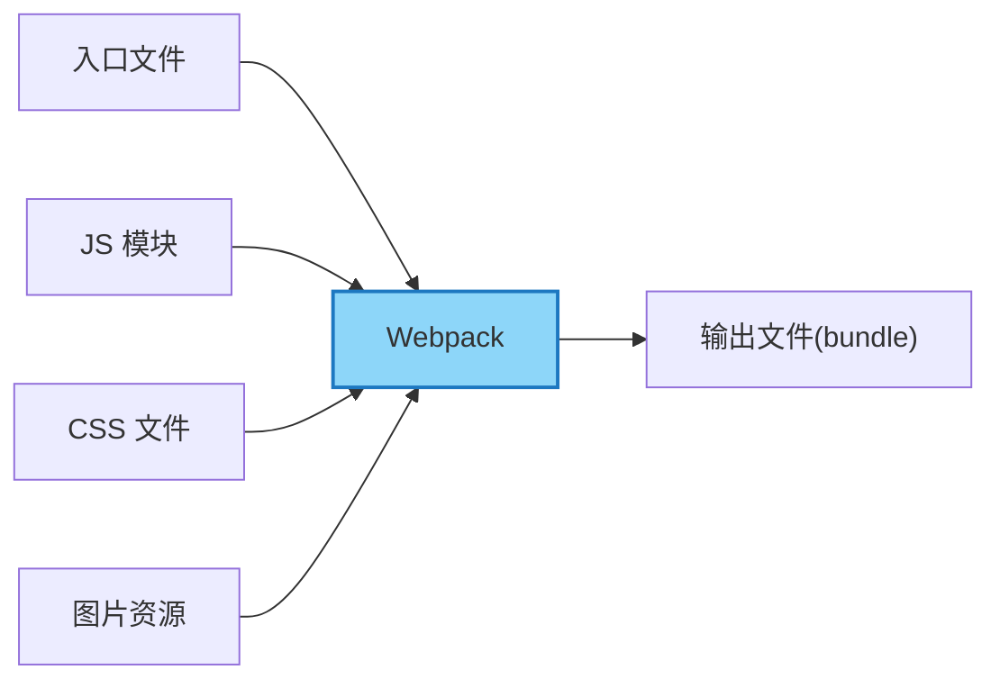

# Mochi 学习卡片转语音朗读卡片提示词

## 任务描述

将 Mochi 学习卡片转换成适合语音朗读的格式，移除不适合语音朗读的元素，优化内容结构以提升朗读体验。

## 输入和输出

**输入**：Mochi 格式的学习卡片（Markdown 文件）
**输出**：适合语音朗读的 Markdown 文件

## 转换规则

请按照以下规则处理 Mochi 学习卡片：

1. **需要移除的内容**：
   - 移除所有 `Tags` 行及其内容
   - 移除所有代码块（Fenced Code Block），包括 ```javascript、```mermaid 等所有代码段
   - 移除所有与代码块相关联的导入文本
   - 移除所有 `> [!NOTE]` 行，但保留其后的「费曼式解释」的内容
   - 移除所有填空内容，如 {{关键词}}，直接使用关键词文本
   - 移除所有 `---` 和 `***` 分隔符

2. **内容处理**：
   - 保留卡片标题和问题
   - 保留解释性文本和核心概念
   - 将填空题 {{关键词}} 转换为普通文本，如 {{静态模块打包工具}} 变为 "静态模块打包工具"
   - 将所有费曼式解释直接作为正文内容保留
   - 调整段落结构使其适合语音朗读

3. **格式优化**：
   - 使用简单清晰的段落结构
   - 确保语句流畅，适合语音朗读
   - 添加适当的过渡词以增强语音朗读的连贯性
   - 如有列表，保持列表格式，但确保每项都是完整句子
   - 避免过长的句子，必要时拆分为多个短句

4. **特殊情况处理**：
   - 如果代码块包含重要概念但不适合直接朗读，将其转换为描述性文本
   - 如果 Mermaid 图表包含重要信息，将其转换为文字描述
   - 技术术语保持原样，但可考虑添加简短解释

## 额外优化建议

1. **语音朗读优化**：
   - 避免使用特殊符号和过多的专业缩写
   - 对于容易混淆的术语，考虑添加发音指导
   - 将不必要的括号内容转换为独立句子
   - 确保数字、日期等内容以适合朗读的方式呈现

2. **结构优化**：
   - 每个主要概念前可添加简短引导语
   - 重要概念后可添加简短总结
   - 确保问题和答案之间有清晰的过渡
   - 适当添加"首先"、"其次"、"最后"等顺序词增强朗读流畅度

3. **易于理解的转换**：
   - 将复杂的技术描述简化为更直观的解释
   - 保留费曼式解释中的比喻和类比，这些通常更适合语音理解
   - 对于链接文本，提取其有意义的部分而非URL
   - 确保专业术语在首次出现时有简短解释

## 示例转换

**原始 Mochi 卡片**：
```
## 什么是 Webpack？

Tags: #Webpack #Webpack/Beginner #Webpack/Concept #Webpack/Core

---

Webpack 是一个现代 JavaScript 应用程序的{{静态模块打包工具}}。当 webpack 处理应用程序时，它会在内部构建一个{{依赖图}}，此{{依赖图}}对应映射到项目所需的每个{{模块}}，然后生成一个或多个 {{bundle}}。

> [!NOTE]
> 费曼式解释：想象你有很多散落的乐高积木（JavaScript 文件、CSS、图片等），每个积木都有特定的用途。Webpack 就像一个助手，它知道哪些积木需要连接在一起，并按照你的指示将它们组装成一个完整的玩具（打包后的应用）。它不仅仅是简单地把积木堆在一起，还会按照正确的顺序和结构组装，确保最终的玩具能够正常工作。


```

**转换后适合语音朗读的内容**：
```
## 什么是 Webpack？

Webpack 是一个现代 JavaScript 应用程序的静态模块打包工具。当 webpack 处理应用程序时，它会在内部构建一个依赖图，此依赖图对应映射到项目所需的每个模块，然后生成一个或多个 bundle。

想象你有很多散落的乐高积木（JavaScript 文件、CSS、图片等），每个积木都有特定的用途。Webpack 就像一个助手，它知道哪些积木需要连接在一起，并按照你的指示将它们组装成一个完整的玩具（打包后的应用）。它不仅仅是简单地把积木堆在一起，还会按照正确的顺序和结构组装，确保最终的玩具能够正常工作。

Webpack 的工作流程可以描述为：首先接收入口文件，然后处理 JavaScript 模块、CSS 文件和图片资源等，最终输出打包好的文件（bundle）。
``` 