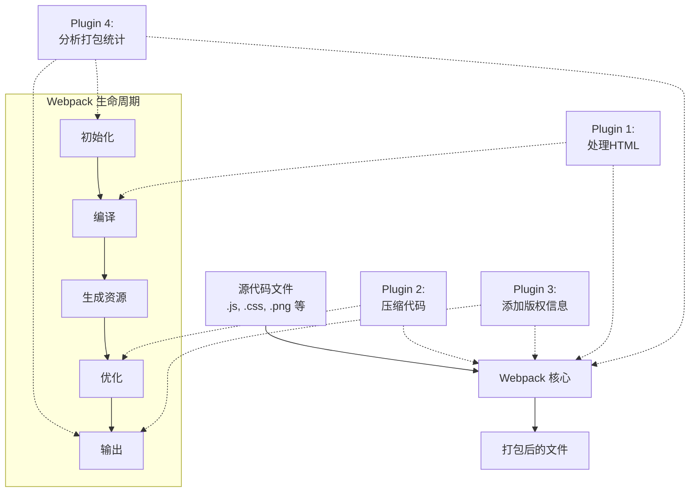

# Webpack 插件的费曼技巧讲解

## 极简定义

插件就像是给乐高积木城堡添加特殊功能的魔法工具。它们可以让你的城堡添加灯光、移动部件或者特殊效果，让原本简单的积木变得更加强大和有趣。

## 从基本原理开始

当我们制作网站时，会写很多代码文件。但这些文件不能直接在网络上运行，需要整理和打包。Webpack 就是帮我们整理这些文件的工具。

想象一下，你有一堆不同类型的乐高积木散落在地上：

1. 首先，你需要把积木按颜色和形状分类（这是 Webpack 的基本功能）
2. 然后，你可能想做更多事情：给某些积木涂色、组合特定积木，或者创建特殊结构

Webpack 的基本功能只能处理"分类积木"这样的简单任务。但如果你想做更复杂的事情，就需要"插件"。

插件解决了 Webpack 在处理文件时的特殊需求。比如：
- 压缩代码使网站加载更快
- 自动添加版权信息到你的代码
- 分析打包过程并显示进度
- 自动生成网页文件
- 在开发过程中自动刷新浏览器

## 生动类比

### 类比一：厨房里的电器

想象 Webpack 是一个基本的厨房搅拌机。它可以搅拌食材（你的代码文件）成一个顺滑的混合物（打包后的代码）。

- **基本搅拌机**：只能搅拌食材
- **插件**：像是各种附加工具，比如切片器、研磨器、榨汁器等

如果你只需要简单搅拌，基本功能就够了。但如果你想做一杯复杂的冰沙，需要先切水果（代码转换）、磨碎坚果（压缩），并添加特殊调料（特定功能），这时候你就需要插件。

这些附加工具不改变搅拌机的核心功能，但极大地扩展了它的能力范围。

### 类比二：汽车改装

把 Webpack 想象成一辆基本款汽车：

- **基本汽车**：能载你从 A 点到 B 点（把代码从开发转变为可用的网站）
- **插件**：像是汽车改装配件，如GPS导航、倒车雷达、自动泊车系统

基本款汽车已经能开，但这些额外的配件让驾驶体验更好，增加了安全性和便利性。同样，Webpack 插件不改变核心打包过程，但可以添加各种功能，使开发过程更高效、输出更优化。

## 实例和故事

小明是一个刚开始学习制作网站的学生。他写了一些代码文件，包括：
- 描述页面结构的 HTML 文件
- 控制样式的 CSS 文件
- 控制交互的 JavaScript 文件

小明想把这些文件合并起来，这样网站加载速度会更快。他使用了 Webpack 来完成这个任务。

**基本场景**：Webpack 帮小明把这些文件打包成了一个文件。网站可以运行了，但小明发现了一些问题：
1. 代码太大，导致网站加载慢
2. 每次修改代码后，他必须手动重新打包
3. 他想添加一些自动生成的信息，比如版本号

**使用插件解决问题**：
1. 小明添加了一个"压缩插件"，把代码中的空格和不必要的字符删除，文件大小减少了50%
2. 他又添加了一个"热更新插件"，这样每次修改代码，网站会自动更新，不需要手动操作
3. 最后，他添加了一个"横幅插件"，自动在代码顶部添加版本信息和版权声明

现在，小明的开发过程更高效，网站性能也更好，这一切都是因为他使用了 Webpack 插件。

## 识别和补充知识缺口

理解 Webpack 插件时，可能会有一些困惑：

**困惑点一：插件和 Loader 的区别**

想象你在做一个拼图游戏：
- Loader 就像是把特殊形状的拼图块转换成标准形状，这样它们才能被拼图游戏（Webpack）处理
- 插件则是改变整个拼图过程的规则，比如自动排序拼图块、记录拼图进度，或在拼图完成后添加装饰

**困惑点二：为什么需要那么多插件**

就像一个专业厨师需要很多不同的工具来制作美食一样，不同的网站项目有不同的需求。一个插件专注解决一个特定问题，这样：
1. 你可以只选择需要的功能
2. 每个插件可以做得更专业
3. 整个系统更灵活，可以根据需求组合不同插件

## 创造互动式理解

想一想你最喜欢的手机应用，它可能有很多功能。现在想象这个应用的核心只是显示信息，而其他所有功能（拍照、分享、编辑等）都是通过"插件"添加的。

**练习**：假设你正在使用 Webpack 开发一个网站，遇到了以下情况，你会使用什么插件？

1. 你想在开发过程中看到打包进度 → _____?
2. 你想自动生成 HTML 文件来引用你的打包文件 → _____?
3. 你想在所有代码文件顶部添加版权信息 → _____?

答案：
1. ProgressPlugin
2. HtmlWebpackPlugin
3. BannerPlugin

如果你能正确回答这些问题，说明你已经理解了插件的基本概念和用途！

## 简化代码示例

下面是一个极简的 Webpack 配置，展示了如何使用插件：

```javascript
// webpack.config.js - Webpack 的配置文件

const webpack = require('webpack');  // 引入 webpack 以使用内置插件
const HtmlWebpackPlugin = require('html-webpack-plugin');  // 引入外部插件

module.exports = {
  // 入口：你的主要代码文件
  entry: './src/index.js',
  
  // 出口：打包后的文件去向
  output: {
    filename: 'bundle.js',
    path: __dirname + '/dist'
  },
  
  // 插件配置
  plugins: [
    // 显示打包进度的插件
    new webpack.ProgressPlugin(),
    
    // 自动生成 HTML 文件的插件
    new HtmlWebpackPlugin({
      template: './src/index.html',  // 使用这个文件作为模板
      filename: 'index.html'  // 输出的文件名
    }),
    
    // 在文件顶部添加版权信息的插件
    new webpack.BannerPlugin({
      banner: '版权所有 © 2023 我的网站'
    })
  ]
};
```

这个配置做了三件事：
1. 显示打包进度
2. 自动生成一个包含打包后文件引用的 HTML 文件
3. 在所有输出的 JavaScript 文件顶部添加版权信息

## 避免术语堆砌

在 Webpack 中，我们常常会遇到一些专业术语，让我们用简单的词语解释它们：

- **编译器（Compiler）**：就像是工厂的总管理员，负责整个打包过程
- **编译（Compilation）**：一次完整的打包过程，就像是工厂的一次生产流程
- **钩子（Hooks）**：特定时刻的信号，就像是工厂生产线上的检查点
- **Tapable**：Webpack 的插件系统，就像是工厂里不同机器之间的连接器

## 循序渐进

### 五岁小孩理解版

插件就像是你的积木玩具的特殊配件。普通积木只能搭建，但如果加上特殊配件，你的积木城堡就能亮灯、旋转或者发出声音了！

### 高中生理解版

Webpack 插件就像是手机应用的扩展功能。基本的手机应用可能只能发消息，但通过添加不同的插件，你可以添加滤镜、特效、自动回复等功能，而不需要重写整个应用程序。

### 编程初学者理解版

在编程中，我们遵循"单一职责原则"，即每个程序组件应该只做一件事，但做好。Webpack 核心只关注基本的模块打包，而插件系统允许在不修改核心代码的情况下扩展功能。插件通过注册到 Webpack 编译过程的不同阶段（钩子），在特定时刻执行特定任务。

## Webpack 在开发流程中的位置

在现代前端开发中，Webpack 是将你的源代码转变为可部署代码的关键工具。

**开发环境中的插件**：
- 热模块替换插件：让你修改代码后，浏览器自动更新，不丢失状态
- 开发服务器插件：提供本地开发服务器
- 源代码映射插件：帮助调试代码

**生产环境中的插件**：
- 代码压缩插件：减小文件大小
- 代码分割插件：优化加载速度
- 资源优化插件：处理图片、字体等

插件让 Webpack 能够适应不同的开发阶段需求，提高开发效率并优化最终产品性能。

## 承认局限性

这个简化的解释虽然捕捉了 Webpack 插件的本质，但也有一些局限性：

1. 我们简化了插件的内部工作机制，实际上插件如何与 Webpack 交互更复杂
2. 没有深入探讨插件之间的依赖和交互
3. 没有讨论如何编写自定义插件

如果你想深入了解 Webpack 插件，推荐以下资源：
- [Webpack 官方文档中的插件部分](https://webpack.js.org/concepts/plugins/)
- [编写一个 Webpack 插件的指南](https://webpack.js.org/contribute/writing-a-plugin/)

记住，理解插件的概念是迈向掌握 Webpack 的重要一步，但真正的掌握需要实践和不断学习。

## 用 Mermaid 图解 Webpack 插件系统



这个图表展示了 Webpack 如何作为中心处理源代码，而插件如何在不同阶段介入这个过程，每个插件负责特定功能，共同构成一个强大的构建系统。 